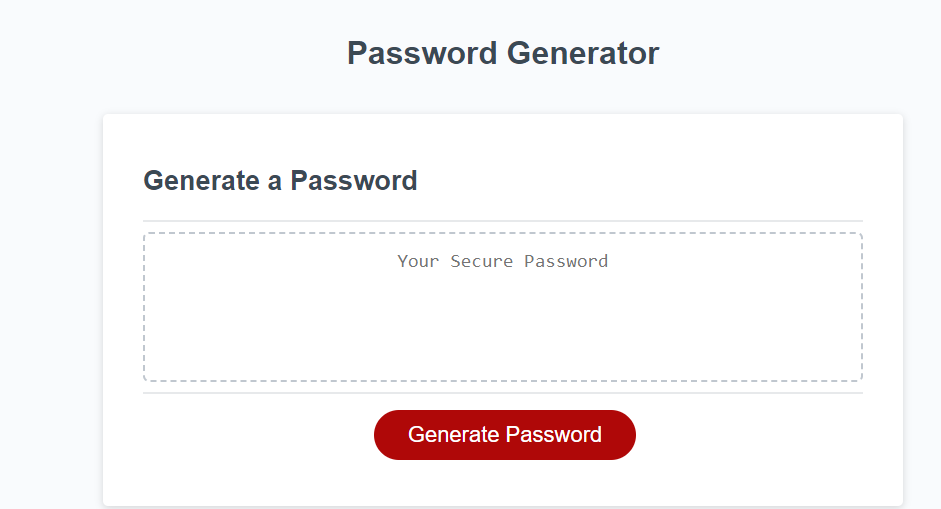

# Challenge3-Password-Generator-JS-Improvements

## Description
 The challenge was to resemble an "On-the-job ticket" and were given starter code for a application that could generate a random password. The criteria was as follows:
Acceptance Criteria
GIVEN I need a new, secure password
WHEN I click the button to generate a password
THEN I am presented with a series of prompts for password criteria
WHEN prompted for password criteria
THEN I select which criteria to include in the password
WHEN prompted for the length of the password
THEN I choose a length of at least 8 characters and no more than 128 characters
WHEN asked for character types to include in the password
THEN I confirm whether or not to include lowercase, uppercase, numeric, and/or special characters
WHEN I answer each prompt
THEN my input should be validated and at least one character type should be selected
WHEN all prompts are answered
THEN a password is generated that matches the selected criteria
WHEN the password is generated
THEN the password is either displayed in an alert or written to the page

  ## Installation
 No installation required

 ## Usage

[Github Page Address](https://tonyworldchanger.github.io/Challenge3-Password-Generator-JS-Improvements/)

 The application works by pressing the red "Generate Password" button. The user will be prompted with five questions. 
 1. Character Length
 2.Does the user want to the password to include lowercase letters.
 3.Does the user want to the password to include uppercase letters.
 4.Does the user want to the password to include special characters.
 5.Does the user want to the password to include numbers.

 Character Length must be between 8-128 characters. If this is not entered correctly, the user will not be allowed to proceed. The "cancel" option will tell the application not use above user choices. 

### ScreenShot of Challenge

## Credits
Mr. Vega Tutorials - Daniel Vega Youtube page
Instructor Aaron Brown
Florin Pop - Youtube page 
